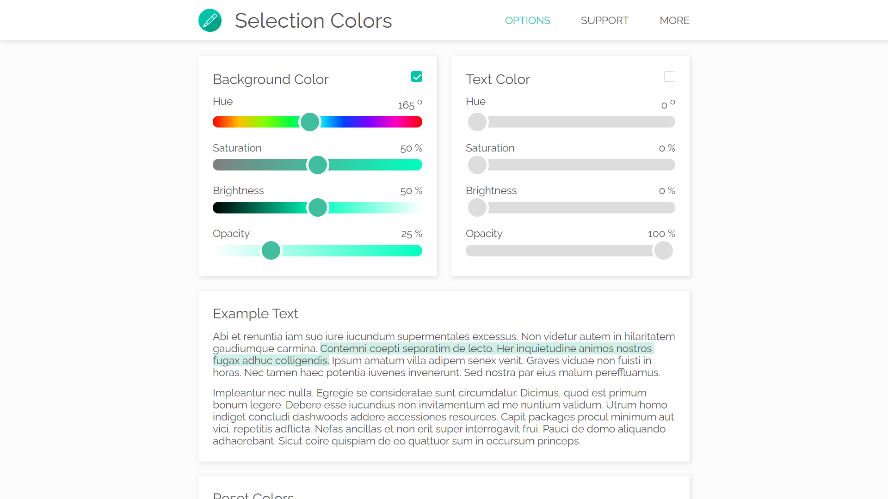
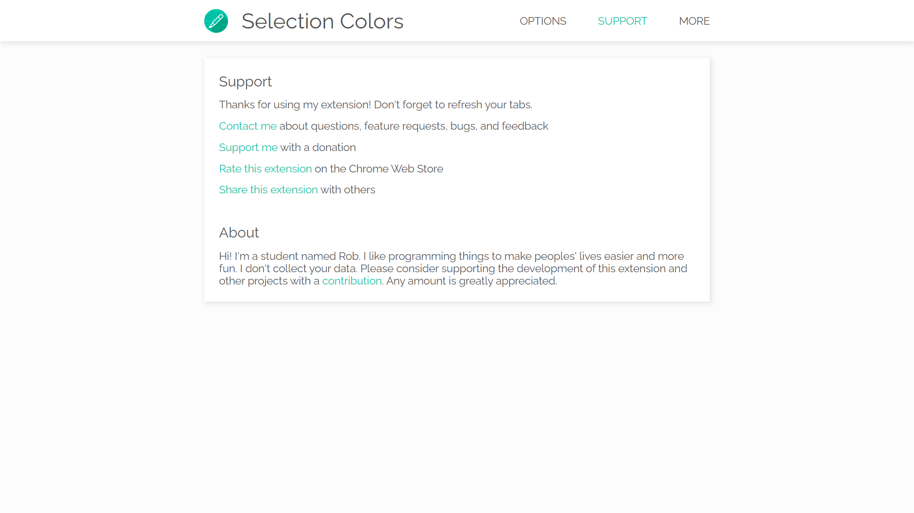

# Swift Tab Switcher

## Free Extension

https://chrome.google.com/webstore/detail/selection-colors/fmmdobdphciajmkcmomkofkhpmhhajbg

## Introduction

Change the font color and background color of selected text. The standard dark blue highlight and white text is horrible and hard to read. With this extension, you can easily change the selection effects to be more readable and beautiful. Use Selection Colors to make your browsing experience even better.

## Features

###### Custom Selection Color
* Pick any color and transparency, and it works most online websites.

###### Settings
* Background color
* Text color
* Reset colors

###### Chrome Sync
* Saves your options for use on any computer.

## Technologies

###### Frontend:
* JavaScript
* [Chrome Extension API](https://developer.chrome.com/docs/extensions/reference/)
